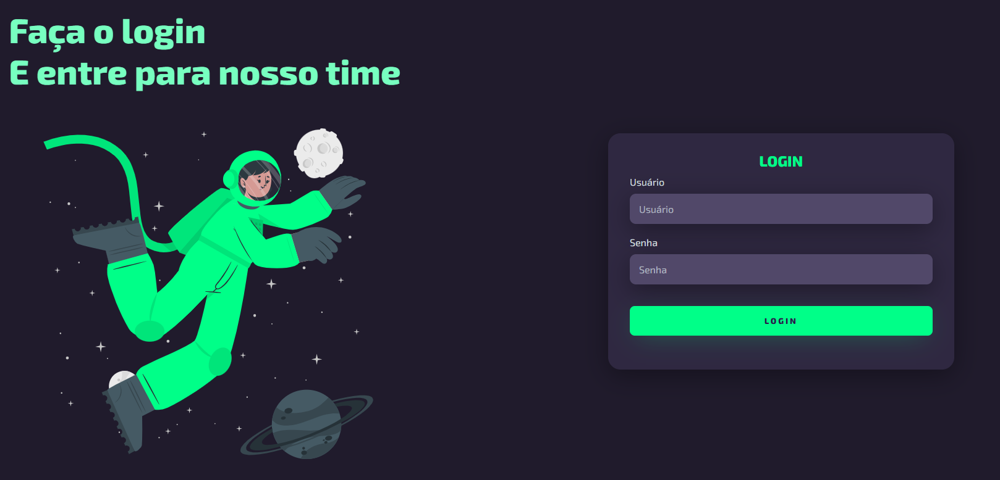
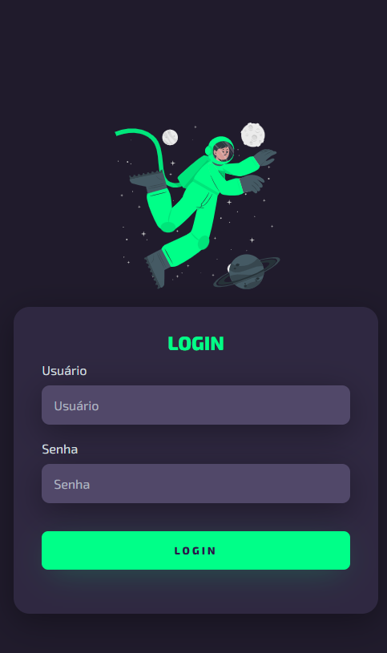

# Sistema de Login

Este é um projeto simples de uma página de login criada utilizando HTML e CSS.

  

  

## Estrutura do Projeto

O projeto está estruturado da seguinte forma:

- **src/css/style.css**: Arquivo CSS para estilizar a página de login.
- **src/css/reset.css**: Arquivo CSS para resetar estilos padrões do navegador.
- **astronauta.svg**: Imagem de um astronauta utilizada na página.
- **index.html**: Arquivo HTML que contém a estrutura da página de login.

## Pré-requisitos

Certifique-se de ter um navegador da web instalado para visualizar a página.

## Como Usar

1. Clone ou faça o download deste repositório.
2. Abra o arquivo `index.html` em seu navegador.

## Recursos Externos

- **Google Fonts**: O projeto utiliza a fonte "Exo 2" do Google Fonts para estilização.

## Contribuição

Contribuições são bem-vindas! Sinta-se à vontade para abrir issues ou pull requests.

